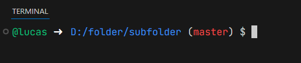
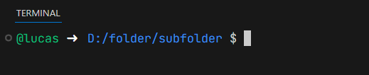

# GitHub Codespaces (inspired) Oh My Posh Theme



---

<div align="center">
<div><a href="#en">About the theme </a>&nbsp;&nbsp;|&nbsp;&nbsp;
<a href="#pt-br">Sobre o tema </div>
</div>

---

## <a id="en"></a>About the theme 

A minimalist Oh My Posh theme inspired by the **GitHub Codespaces 2025** terminal.

### 📸 Preview

**Without Git repository:**



**With Git repository:**


### 📋 Requirements

- [Oh My Posh](https://ohmyposh.dev/) installed
- A [Nerd Font](https://www.nerdfonts.com/) (recommended: JetBrains Mono Nerd Font, Cascadia Code NF)
- PowerShell, Bash, Zsh or any compatible shell

### 🎨 Customization

**Change path style:**

In `theme.json`, modify the `path` segment's `style` property:

- `"folder"` - current folder name only
- `"short"` - shortened path with `~`
- `"full"` - complete path
- `"agnoster_short"` - first letter of each folder

**Change colors:**

Edit `foreground` values:
- Username: `#0dbc79` (green)
- Path: `#3b8eea` (blue)
- Git branch: `#da0202` (red)

### 🖼️ Theme

```javascript
{
  "$schema": "https://raw.githubusercontent.com/JanDeDobbeleer/oh-my-posh/main/themes/schema.json",
  "blocks": [
    {
      "alignment": "left",
      "segments": [
        {
          "foreground": "#0dbc79",
          "style": "plain",
          "template": "@{{ .UserName }}",
          "type": "session"
        },
        {
          "foreground": "#ffffff",
          "style": "plain",
          "template": " \u279c ",
          "type": "text"
        },
        {
          "foreground": "#3b8eea",
          "properties": {
            "style": "folder",
            "folder_separator_icon": "/"
          },
          "style": "plain",
          "template": " {{ .Path }}",
          "type": "path"
        },
        {
          "foreground": "#cccccc",
          "properties": {
            "branch_icon": "",
            "fetch_status": false
          },
          "style": "plain",
           "template": "{{ if .RepoName }} (<#da0202>{{ .HEAD }}</>){{ end }}",
          "type": "git"
        },
        {
          "foreground": "#cccccc",
          "style": "plain",
          "template": " $",
          "type": "text"
        }
      ],
      "type": "prompt"
    }
  ],
  "final_space": true,
  "version": 3
}
```

---

## <a id="pt-br"></a>Sobre o tema 

Um tema minimalista para Oh My Posh inspirado no terminal do **GitHub Codespaces 2025**.

### 📸 Preview

**Sem repositório Git:**


**Com repositório Git:**


### 📋 Requisitos

- [Oh My Posh](https://ohmyposh.dev/) instalado
- Uma [Nerd Font](https://www.nerdfonts.com/) (recomendado: JetBrains Mono Nerd Font, Cascadia Code NF)
- PowerShell, Bash, Zsh ou qualquer shell compatível

### 🎨 Customização

**Mudar estilo do caminho:**

No `theme.json`, modifique a propriedade `style` do segmento `path`:

- `"folder"` - apenas nome da pasta atual
- `"short"` - caminho encurtado com `~`
- `"full"` - caminho completo
- `"agnoster_short"` - primeira letra de cada pasta

**Mudar cores:**

Edite os valores de `foreground`:
- Username: `#0dbc79` (verde)
- Path: `#3b8eea` (azul)
- Git branch: `#da0202` (vermelho)


### 🖼️ Tema

```javascript
{
  "$schema": "https://raw.githubusercontent.com/JanDeDobbeleer/oh-my-posh/main/themes/schema.json",
  "blocks": [
    {
      "alignment": "left",
      "segments": [
        {
          "foreground": "#0dbc79",
          "style": "plain",
          "template": "@{{ .UserName }}",
          "type": "session"
        },
        {
          "foreground": "#ffffff",
          "style": "plain",
          "template": " \u279c ",
          "type": "text"
        },
        {
          "foreground": "#3b8eea",
          "properties": {
            "style": "folder",
            "folder_separator_icon": "/"
          },
          "style": "plain",
          "template": " {{ .Path }}",
          "type": "path"
        },
        {
          "foreground": "#cccccc",
          "properties": {
            "branch_icon": "",
            "fetch_status": false
          },
          "style": "plain",
           "template": "{{ if .RepoName }} (<#da0202>{{ .HEAD }}</>){{ end }}",
          "type": "git"
        },
        {
          "foreground": "#cccccc",
          "style": "plain",
          "template": " $",
          "type": "text"
        }
      ],
      "type": "prompt"
    }
  ],
  "final_space": true,
  "version": 3
}
```

---

> Made with ☕ by [@lvcaspacifico](https://github.com/lvcaspacifico) 👋